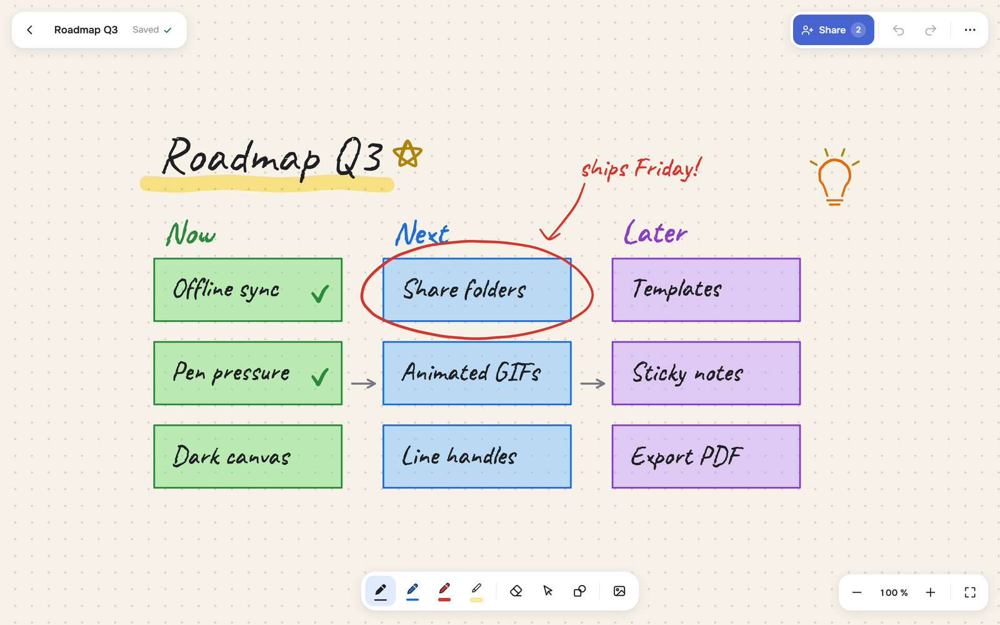
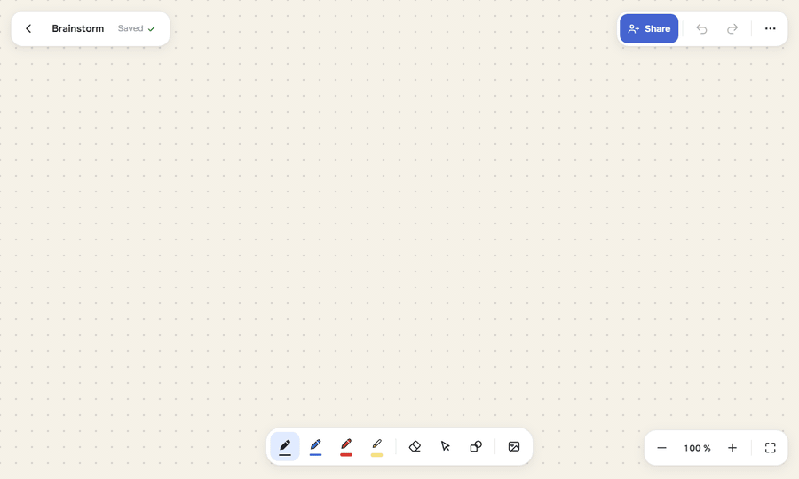
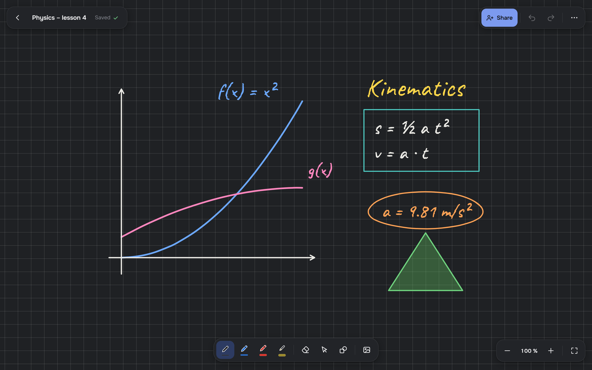
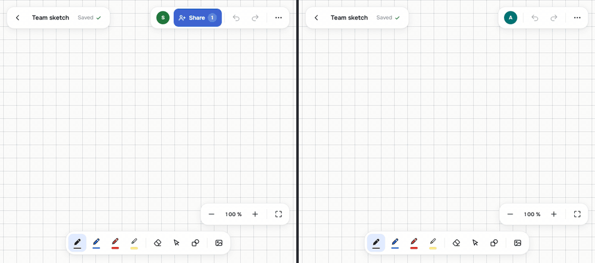
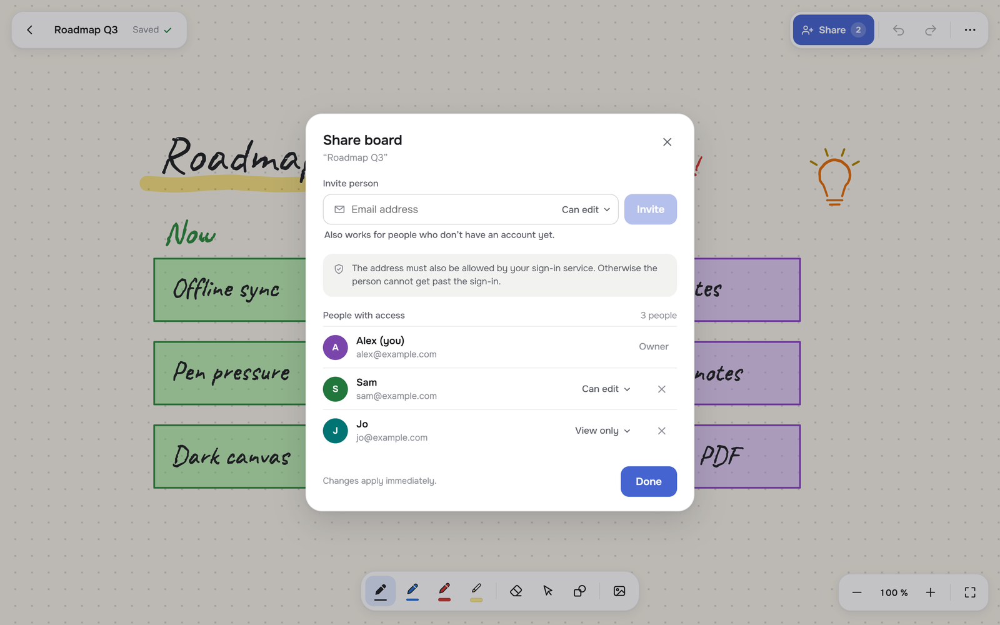
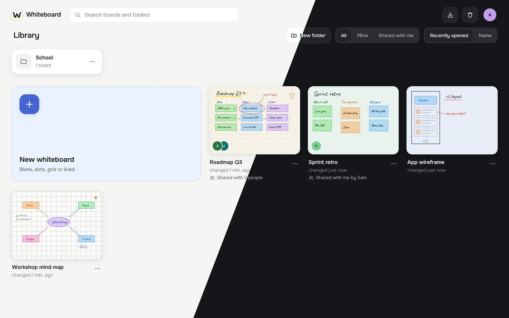
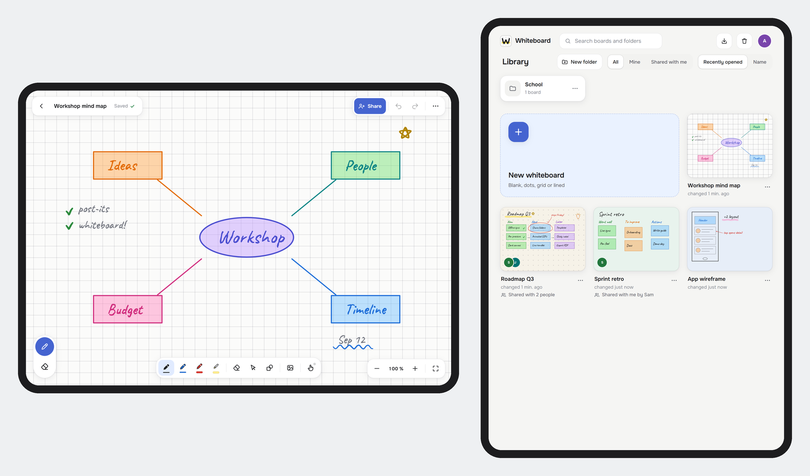

<p align="center">
  
</p>

<h1 align="center">Whiteboard</h1>

<p align="center">
  A self-hosted whiteboard with real pen feel: freehand ink, shapes and images on an infinite canvas,<br>
  live collaboration, offline support, and a home on your own server.
</p>

<p align="center">
  <a href="#run-it">Run it</a> ·
  <a href="SELF_HOSTING.md">Self-hosting guide</a> ·
  <a href="#features">Features</a> ·
  <a href="#development">Development</a>
</p>

<p align="center">
  
</p>

Whiteboard is a progressive web app built for drawing with a pen: Apple Pencil on the iPad, a Wacom tablet on the desktop, or a mouse if you must. It installs to the home screen, keeps working without a connection, and syncs every stroke live to everyone looking at the same board.

It runs as two small containers (a static web app and a Node API with SQLite). A Raspberry Pi is enough.

## Draw

<p align="center">
  
</p>

- **Pressure-sensitive ink** with adjustable smoothing, four pen slots and a translucent highlighter
- **Eraser** for whole strokes or for precisely the ink under the cursor
- **Shapes**: line, arrow, rectangle, ellipse and triangle, with optional fill. Hold <kbd>Shift</kbd> while drawing for a straight line, add <kbd>Ctrl</kbd> to snap it to 15° steps
- **Selection** by tap, frame or lasso. Move, scale, rotate, recolor, change thickness, duplicate, reorder, copy and paste. Drag either end of a line or arrow to change it
- **Images** from files, the camera, the clipboard or drag and drop. Animated GIFs play
- **Canvas**: infinite, with six colors (including a dark chalkboard) and blank, dotted, grid or lined paper

<p align="center">
  
</p>

## Together

<p align="center">
  
</p>

- **Live collaboration** over WebSocket. Strokes appear while they are being drawn, with named cursors
- **Share boards and whole folders** by email address, as *can edit* or *view only*. It also works for people who haven't signed in yet
- **Offline first**: changes are kept on the device and sent when the connection is back

<p align="center">
  
</p>

## Organize

<p align="center">
  
</p>

- **Library** with previews, folders, search and sorting, and filters for *mine* and *shared with me*
- **Trash** keeps boards and folders for 30 days and restores them into their old folder structure
- **Import** exports from Microsoft Whiteboard (ZIP or HTML). **Export** to PNG, SVG or a `.whiteboard` file
- **Light, dark or system** appearance. **English and German**, switchable at any time

<p align="center">
  
</p>

Made for the iPad and Apple Pencil: the pencil draws, fingers pan and zoom, and a switch in the toolbar lets the finger draw as well. Pen and eraser sit within thumb reach at the edge. On a phone, boards open in a viewing mode that keeps the canvas free, and one tap on *Edit* brings the tools back.

## Run it

You need Docker with the Compose plugin.

```bash
git clone <this repository> whiteboard
cd whiteboard
cp .env.example .env
```

Pick how people sign in (`AUTH_MODE` in `.env`):

| Mode | For |
|---|---|
| `cloudflare` | [Cloudflare Access](https://developers.cloudflare.com/cloudflare-one/applications/) in front of the app. The server verifies the signed token. This is the default. |
| `header` | Your own sign-in proxy (Authelia, Authentik, oauth2-proxy, …) that passes the user's email in a header |
| `single` | No sign-in, a single shared user. Only for a network nobody else can reach (home network, Tailscale) |

```bash
docker compose up -d --build
```

The app now listens on `http://127.0.0.1:8080`. Put a reverse proxy with HTTPS in front of it: the service worker, the camera and the clipboard need a secure context. The [self-hosting guide](SELF_HOSTING.md) walks through all three sign-in modes, HTTPS, updates and backups.

Your data lives in `./data`: one SQLite database and the uploaded images. Back up that folder.

## Development

Node 22.9 or newer. Two terminals:

```bash
cd server && npm install && npm run dev
```

```bash
cd web && npm install && npm run dev
```

The app runs on `http://localhost:5173` and proxies `/api` to the server on port 3000. Without a sign-in service in front, the server needs to know who you are. Put this in `server/.env`:

```
DEV_EMAIL=you@example.com
```

The server refuses to start if `DEV_EMAIL` is set together with `NODE_ENV=production`.

### Checks

```bash
cd server && npm test
```

The test starts the server against a fresh database in a temporary folder, runs through the API, the live sync and the three sign-in modes, and cleans up afterwards.

Every web build (`npm run build`, or just the checks: `npm run pruefen`) also verifies that

- every component imports the React hooks it uses
- both languages have exactly the same texts, placeholders and plural forms, and every server error code has a translation
- no text is hard-coded in JSX instead of going through `t()`

### Layout

| Where | What |
|---|---|
| `web/src/zeichnen/` (*drawing*) | Drawing engine without React: smoothing, elements, eraser, selection, rendering, export |
| `web/src/Bibliothek.jsx` (*library*), `BoardEditor.jsx`, `editor/`, `bibliothek/` | User interface |
| `web/src/daten/` (*data*) | Storage (server plus an offline buffer in IndexedDB), live sync, settings |
| `web/src/i18n/` | Translations (`en.js`, `de.js`) |
| `web/src/import/` | Import of Microsoft Whiteboard exports |
| `server/src/` | Fastify API: boards, folders, sharing, images, live sync, sign-in |
| `deploy/pi/`, `deploy.sh` | Alternative deployment: build on a PC, ship to a small ARM server ([deploy/README.md](deploy/README.md)) |

`#/labor` is a test bench for the pen feel with every smoothing parameter exposed.

The code, its comments and some folder names are in German (translations in *italics* above); the app itself speaks English and German.

## License

Copyright © 2026 Layzor

[GNU Affero General Public License v3.0](LICENSE). You may use, study, change and share this software, including commercially. If you distribute it, or let people use a modified version over a network, you must publish your source code under the same license and keep the copyright notices.

Fonts and libraries that ship with the app keep their own licenses, see [THIRD-PARTY-NOTICES.md](THIRD-PARTY-NOTICES.md).

This project is not affiliated with Microsoft. "Microsoft Whiteboard" only names the format the importer reads.
